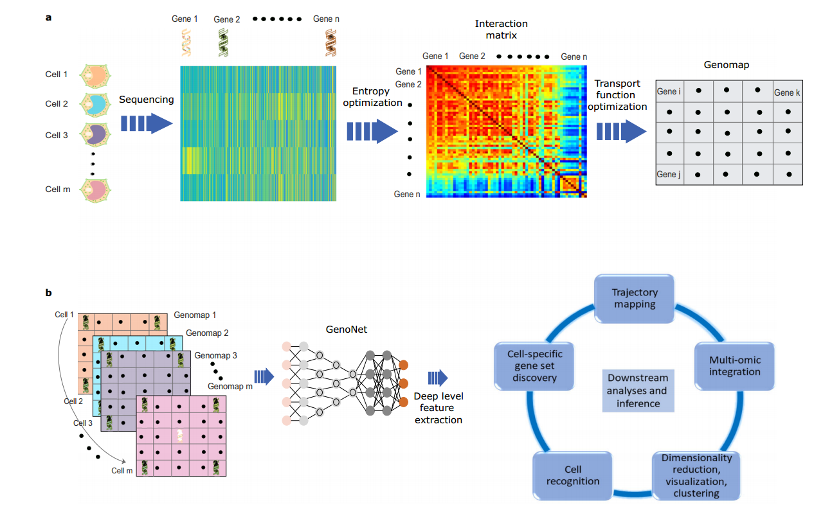

# The Replicate of GenoMap and TCER

The success of transcriptomic studies depends critically on the accuracy of the gene expression counts. In practice, gene expression data often suffer from low transcript capture efficiency and technical noise, leading to inaccurate gene counts. Thus, recovery of the expression values of the genes using computational techniques is critical for the downstream applications. Existing methods of gene expression recovery techniques suffer from either accuracy or computational efficiency or both ,which limits their practical applications. In reality, it has long been recognized that gene–gene interactions may serve as reflective indicators of underlying biology processes, presenting discriminative signatures of the cells. A genomic data analysis framework that is capable of leveraging the underlying gene–gene interactions is thus highly desirable and could allow for more reliable identification of distinctive patterns of the genomic data through extraction and integration of intricate biological characteristics of the genomic data. Based on the above questions, Wei et al. leverage the interactive information and establish a transform-and-conquer expression recovery (TCER) strategy to tackle the gene imputation problem. 

## TCER
TCER is a self-supervised deep learning framework for gene expression recovery. The proposed pipeline consists of two steps, inluding (i) we first reposition the genes in such a way that their spatial configuration reflects their interactive relationships; and (ii) we then use a self-supervised 2D convolutional neural network (ER-Net) to extract the contextual features of the interactions from the spatially configured genes and impute the omitted values. 

## Structure of TCER

### Pipeline


Pipeline of the proposed TCER as shown in the first picture. 1D gene expression data is first converted into an image format where the gene–gene interactions are reflected naturally in the spatial configuration of GenoMap. A dropout simulation strategy is then applied to simulate the dropout events where non-zero values are randomly masked. Last, the proposed ER-Net is employed to impute the masked GenoMap. The GenoMap construction is critical in TCER for the network to recover the gene expression values.


### ER-Net Structure


To extract deep interaction information from a GenoMap for the recovery of missing expression values, a novel encoderdecoder architecture referred to as expression recovery network (ER-Net) is designed. Network structure of ER-Net as shown in the second picture. In figure(A) ER-Net follows an encoder-decoder structure and employs three cascaded DFA module with deformable convolution to extract both local and global features of gene–gene interactions. In figure(B) Detailed structure of the proposed DFA module.

## GenoMap

Genomap is an entropy-based cartography strategy to contrive the high dimensional gene expression data into a configured image format with explicit integration of the genomic interactions. This unique cartography casts the gene-gene interactions into a spatial configuration and enables us to extract the deep genomic interaction features and discover underlying discriminative patterns of the data. For a wide variety of applications (cell clustering and recognition, gene signature extraction, single-cell data integration, cellular trajectory analysis, dimensionality reduction, and visualization), genomap drastically improves the accuracy of data analyses as compared to state-of-the-art techniques.

## Structure of GenoMap


To maximally reflect the gene-gene interaction information of the system through a 2D spatial configuration of genes, it transform the dataset into a series of cell-specific genomaps by optimizing a transport function. As the possible ways of gene placement into a 2D grid for a cell is a factorial of the number of involved genes, a robust optimization of the transport function is imperative to reliably construct a genomap. In general, a genomap possesses the basic characteristics of an image with the pixelated configuration manifesting the gene-gene interactions and provides a comprehensive representation of the gene expression data. After the construction of the genomaps, we extract the configurational features of the genomic interactions by using an efficient convolutional neural network (CNN) named genoNet. In this way, deep correlative features of the genes are extracted effectively from the data for subsequent decision-making.  For a wide variety of applications, including cell clustering and recognition, gene signature extraction, single cell data integration, cellular trajectory analysis, dimensionality reduction, and visualization, the proposed approach substantially outperforms the state-ofthe-art methods.

## Replicate work

### Data processing and visual analysis

To run the model, you will need to download data files```TM_data.csv``` etc. from [here](https://drive.google.com/drive/folders/1xq3bBgVP0NCMD7bGTXit0qRkL8fbutZ6?usp=drive_link), download the ```TMdata.mat``` from [here](https://github.com/xinglab-ai/genomap/blob/main/MATLAB/TMdata.mat)


### 1. Transform the data by GenoMap

First, we put the ```TMdata.mat``` under the MATLAB folder, run the ```demo_genomap.m``` and ```data.m``` files in the MATLAB folder, build Genomap and get the required data format for TCER. (Using ```Construct_genomap.ipynb``` also works)

### 2. Data visualization

Put the ```TM_data.csv``` data in the same root directory as the genomap folder, and run the following code. You can view the running results in the corresponding files.

### Cluster and visualization the data

Run the ```genoVis.ipynb``` and get the results.

```python
##Perform PCA dimensionality reduction on the data, cluster and visualize using kmeans, cluster according to real labels,
#and visualize the clustering results.

import scipy.io as sio
import numpy as np
import pandas as pd
import genomap.genoVis as gp
import matplotlib.pyplot as plt
from sklearn.cluster import KMeans
from sklearn.decomposition import PCA
import phate
import umap.umap_ as umap

data = pd.read_csv('TM_data.csv', header=None,
                   delim_whitespace=False)
data=data.values
gt_data = sio.loadmat('GT_TM.mat')
y = np.squeeze(gt_data['GT'])
n_clusters = len(np.unique(y))


resVis=gp.genoVis(data,n_clusters=n_clusters, colNum=33,rowNum=33)
# Use resVis=gp.genoVis(data, colNum=32,rowNum=32), if you dont know the number
# of classes in the data

resVisEmb=resVis[0] # Visualization result
clusIndex=resVis[1] # Clustering result

plt.figure(figsize=(15, 10))
plt.rcParams.update({'font.size': 28})    
h1=plt.scatter(resVisEmb[:, 0], resVisEmb[:, 1], c=y,cmap='jet', marker='o', s=18)      #  ax = plt.subplot(3, n, i + 1*10+1)
plt.xlabel('genoVis1')
plt.ylabel('genoVis2')
plt.tight_layout()
plt.colorbar(h1)
plt.show()

import genomap.utils.metrics as metrics
print('acc=%.4f, nmi=%.4f, ari=%.4f' % (metrics.acc(y, clusIndex), metrics.nmi(y, clusIndex), metrics.ari(y, clusIndex)))
```

The function gp.genoVis() is the core method in the genomap package for mapping high-dimensional data to low-dimensional Spaces and performing cluster analysis. First, the structural characteristics of gene interactions were extracted using the previously mentioned genoNet, Then cluster the data and view the clustering results.

###  The analysis of the integration effects and batch effects

Run the ```genoMOI.ipynb``` and get the results.

```python
##Cluster analysis and trajectory analysis of different data sets are carried out. 
#Cluster analysis is combined with local structure to visualize gene data, 
##and trajectory analysis is combined with global information to visualize gene data.
##the data is multi-omic data integration
import scanpy as sc
import matplotlib.pyplot as plt
import scipy.io as sio
import numpy as np
import pandas as pd
import genomap.genoMOI as gp

# Load five different pancreatic datasets
dx = sio.loadmat('dataBaronX.mat')
data=dx['dataBaron']
dx = sio.loadmat('dataMuraroX.mat')
data2=dx['dataMuraro']
dx = sio.loadmat('dataScapleX.mat')
data3=dx['dataScaple']
dx = sio.loadmat('dataWangX.mat')
data4=dx['dataWang']
dx = sio.loadmat('dataXinX.mat')
data5=dx['dataXin']

# Load class and batch labels
dx = sio.loadmat('classLabel.mat')
y = np.squeeze(dx['classLabel'])
dx = sio.loadmat('batchLabel.mat')
ybatch = np.squeeze(dx['batchLabel'])

# Apply genomap-based multi omic integration and visualize the integrated data with local structure for cluster analysis
# returns 2D visualization, cluster labels, and intgerated data
resVis,cli,int_data=gp.genoMOIvis(data, data2, data3, data4, data5, colNum=12, rowNum=12, n_dim=32, epoch=10, prealign_method='scanorama')

# Plot colored with cell class labels
plt.figure(figsize=(15, 10))
plt.rcParams.update({'font.size': 28})    
h1=plt.scatter(resVis[:, 0], resVis[:, 1], c=y,cmap='jet', marker='o', s=18)      
plt.xlabel('genoVis1')
plt.ylabel('genoVis2')
plt.tight_layout()
plt.colorbar(h1)
plt.show()

# Plot colored with batch labels
plt.figure(figsize=(15, 10))
plt.rcParams.update({'font.size': 28})    
h1=plt.scatter(resVis[:, 0], resVis[:, 1], c=ybatch,cmap='jet', marker='o', s=18)      
plt.xlabel('genoVis1')
plt.ylabel('genoVis2')
plt.tight_layout()
plt.colorbar(h1)
plt.show()

# Apply genomap-based multi omic integration and visualize the integrated data with global structure for trajectory analysis

# returns 2D embedding, cluster labels, and intgerated data
resTraj,cli,int_data=gp.genoMOItraj(data, data2, data3, data4, data5, colNum=12, rowNum=12, n_dim=32, epoch=10, prealign_method='scanorama')

# Plot colored with cell class labels
plt.figure(figsize=(15, 10))
plt.rcParams.update({'font.size': 28})    
h1=plt.scatter(resTraj[:, 0], resTraj[:, 1], c=y,cmap='jet', marker='o', s=18)      
plt.xlabel('genoTraj1')
plt.ylabel('genoTraj2')
plt.tight_layout()
plt.colorbar(h1)
plt.show()

# Plot colored with batch labels
plt.figure(figsize=(15, 10))
plt.rcParams.update({'font.size': 28})    
h1=plt.scatter(resTraj[:, 0], resTraj[:, 1], c=ybatch,cmap='jet', marker='o', s=18)      
plt.xlabel('genoTraj1')
plt.ylabel('genoTraj2')
plt.tight_layout()
plt.colorbar(h1)
plt.show()
```

Multi-omics integration and embedding using gp.genoMOIvis.
Use gp.genoMOItraj for global structural integration and embedding:Similar to genoMOIvis, but with a focus on global structure retention.
It is used to infer locus relationships between cells (e.g. developmental trajectories). Load the class labels (classLabel.mat) and batch labels (batchLabel.mat) using sio.loadmat and store them in the y and ybatch variables, respectively.The genome multiomics integration of the data is performed using the gp.genoMOIvis function and the integrated data is visualized for cluster analysis. 

### The Genomap classification

Run the ```genoClassification.ipynb``` and get the results.

```python
##genoClassification for tabular data classification
##A genetic classification algorithm test is performed on the data, 
#and genoClassification integrated in genomap is effective for gene classification.
import pandas as pd
import numpy as np
import scipy.io as sio
import genomap.genoClassification as gp
from genomap.utils.util_genoClassReg import select_random_values

# First, we load the TM data. Data should be in cells X genes format, 
data = pd.read_csv('TM_data.csv', header=None,
                   delim_whitespace=False)

# Creation of genomaps
# Selection of row and column number of the genomaps 
# To create square genomaps, the row and column numbers are set to be the same.
colNum=33 
rowNum=33

# Load ground truth cell labels of the TM dataset
gt_data = sio.loadmat('GT_TM.mat')
GT = np.squeeze(gt_data['GT'])
GT=GT-1 # to ensure the labels begin with 0 to conform with PyTorch

# Select 80% data randomly for training and others for testing
indxTrain, indxTest= select_random_values(start=0, end=GT.shape[0], perc=0.8)
groundTruthTest = GT[indxTest-1]

training_data=data.values[indxTrain-1]
training_labels=GT[indxTrain-1]
test_data=data.values[indxTest-1]

est=gp.genoClassification(training_data, training_labels, test_data, rowNum=rowNum, colNum=colNum, epoch=150)

print('Classification accuracy of genomap approach:'+str(np.sum(est==groundTruthTest) / est.shape[0]))  
```

The purpose of this code is to perform a Genomap classification experiment on the TM dataset based on the genomap method. It includes data loading, pre-processing, training data partitioning, classification model training and performance evaluation. High-dimensional gene expression data is mapped to a two-dimensional matrix (Genomap) based on the Genomap method.
The neural network model constructed by PyTorch is used for the classification task.

### TCER algorithm application

### Requirement
```
torch==1.6.0+cu101
torchvision==0.7.0+cu101	
json5==0.9.6
matplotlib==3.4.3
ninja==1.10.2.2
pandas==1.3.3
scipy==1.7.1
seaborn==0.11.2
umap-learn==0.5.3
```
Since our network includes deformable convolution, please use the following command to set up the required environment. 

```
cd ./models
rm -r DCNv2
unzip DCNv2.zip
cd ./DCNv2
sh ./make.sh         # build
```

### Train

Create a data folder in the TCER directory to save the data obtained during the data processing phase(```CellularTax_dataSAVER10-2000.mat```, ```CellularTax_GTlabel.mat```).

To train our ER-Net from scratch, please use the following command.
```
python train_genoMap.py --dataset 'CellularTax' --rate '10-2000' --epochs 50
```
### Test
To test the trained ER-Net, please use the following command.
```
python test_genoMap.py --dataset 'CellularTax' --rate '10-2000' --epoch_suffix 50 --model_path XXXX
```

### Results visualization
The visualization tutorial could be found in the ```Visulization_TMdata.ipynb```  and  ```Visulization_TCERdata.ipynb```file. 
The TCER data can be download [here](https://drive.google.com/file/d/1H1tpwM96IR21qTKYF3EK5m6ziAVwUKIp/view?usp=share_link)

Through the relicate of the method, we can draw the following conclusions:
TCER can effectively improve the correlation between genes on the basis of GenoMap.
However, it is important to note that TCER is no longer valid if a high level of correlation is reached between the genes after GenoMap processing.
Combining GenoMap with deep learning methods to improve genomap correlation is an effective way to explore the relationships and interactions between genes.


